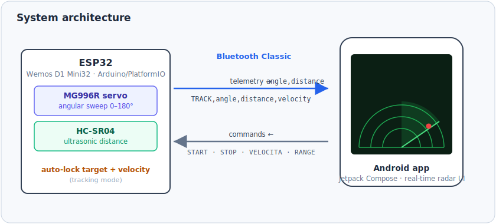
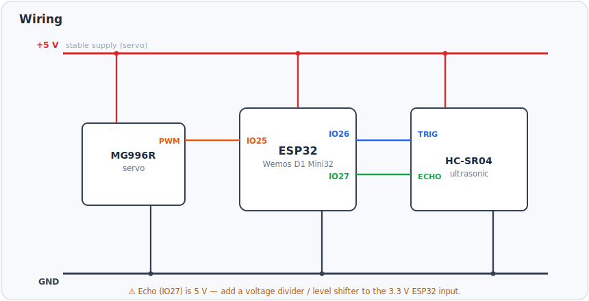

# 📡 ESP32 Radar — ultrasonic scanning & target tracking

A real-time **radar** built on an **ESP32**: a servo sweeps an **HC-SR04** ultrasonic sensor across 180°, streams the readings over **Bluetooth Classic**, and a custom **Android (Jetpack Compose)** app draws the radar and locks onto moving targets.

<p align="center">
  <br>
  <em>ESP32 (servo + ultrasonic) → Bluetooth → Android radar UI.</em>
</p>

Two modes:

- **Sweep** — classic angular scan 0–180°, streaming `angle,distance`.
- **Tracking** — when an object enters the lock range the radar **auto-locks** onto it, follows it, and estimates its **radial velocity**, streaming `TRACK,angle,distance,velocity`.

## Hardware & wiring

| Component | Notes |
|---|---|
| **ESP32** | Wemos D1 Mini32 (Bluetooth Classic) |
| **HC-SR04** | ultrasonic distance sensor |
| **MG996R servo** | 0–180° rotating mount |
| **5 V supply** | stable current for the servo |

| ESP32 pin | Connects to |
|---|---|
| **IO25** | servo **PWM** |
| **IO26** | HC-SR04 **Trig** |
| **IO27** | HC-SR04 **Echo** |
| **5V / GND** | servo + HC-SR04 power |

<p align="center">
  <br>
  <em>Wiring — power on the 5 V / GND rails, three signal lines to the ESP32.</em>
</p>

> ⚠️ The HC-SR04 **Echo** pin outputs 5 V. Feed it to the 3.3 V ESP32 input through a **voltage divider** (or level shifter) to stay within spec.

## Bluetooth protocol

The ESP32 advertises as **`ESP32_Radar`** (Bluetooth Classic / SPP) and exchanges plain-text lines.

**Telemetry (ESP32 → app):**

```
angle,distance                   e.g.  90,182.5      (distance "OUT" if no echo)
TRACK,angle,distance,velocity    e.g.  TRACK,46,73.0,12.4
```

**Commands (app → ESP32):**

| Command | Effect |
|---|---|
| `START` / `STOP` | resume / pause the radar |
| `VELOCITA:<ms>` | sweep step delay, 20–200 ms (lower = faster) |
| `RANGE:<cm>` | lock range for tracking, up to 400 cm |

Every command is acknowledged (`ACK:…` / `NACK:…`).

## How tracking works

1. The servo sweeps 0–180° in 2° steps; at each step the HC-SR04 measures distance and the pair is streamed.
2. When a reading falls inside the lock window (**7 cm … RANGE**, default 100 cm), the radar **locks**.
3. While locked it **fine-tunes** ±5° around the target, keeps the closest return, and computes velocity as Δdistance / Δtime → `TRACK,…`.
4. If the target is lost it does a quick ±15° search; after a **1.5 s** timeout it drops the lock and resumes sweeping.

The servo is driven with hand-timed PWM pulses (500–2500 µs); distance uses `pulseIn` with a 35 ms timeout (≈ 6 m ceiling).

## Firmware (PlatformIO)

```bash
cd firmware
pio run -t upload      # build & flash (set your serial port in platformio.ini)
pio device monitor     # 115200 baud
```

`firmware/src/main.cpp` is the tracking build; board `wemos_d1_mini32`, Arduino framework, `BluetoothSerial`.

## Android app (Jetpack Compose)

`android-app/` is the Android Studio project (Kotlin + Compose). It:

- connects to `ESP32_Radar` over Bluetooth Classic;
- draws a **semicircular radar** with a green sweeping line and a fading trail;
- shows a **distance bar** and the live **angle / distance** values;
- has **AUTO / MANUAL** control, a **scan-speed** slider (`VELOCITA:…`) and a **lock-range** control (`RANGE:…`);
- parses both `angle,distance` and `TRACK,…` frames in real time.

Open `android-app/` in Android Studio, build, and install on a phone with Bluetooth Classic.

## Repository structure

```
esp32-radar-tracking/
├── firmware/                ESP32 firmware (PlatformIO)
│   ├── platformio.ini
│   └── src/main.cpp
├── android-app/             Android app (Jetpack Compose, Kotlin)
│   └── app/src/main/java/com/example/radaresp32/
├── docs/images/             architecture & wiring diagrams
└── README.md
```

## Applications

Low-cost robotics sensing · obstacle scanning · educational radar visualization · mechatronics demos.

## Author

**Alessandro Corgiolu** — System / Embedded Integration & Validation Engineer
GitHub [@corgiolu-labs](https://github.com/corgiolu-labs) · part of a hardware portfolio that also includes [JONNY5](https://github.com/corgiolu-labs/jonny5), the [UAV LoRa transponder](https://github.com/corgiolu-labs/uav-lora-transponder), the [DED powder-flow sensor](https://github.com/corgiolu-labs/ded-powder-flow-sensor) and [RASPYNVERTER](https://github.com/corgiolu-labs/raspinverter).
